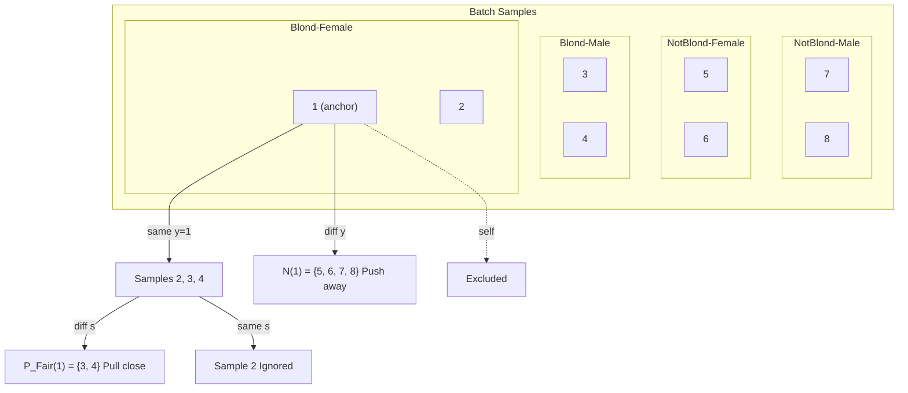

# FairSupCon: De-Biasing CelebA with Fair Supervised Contrastive Learning

CSCI 6320 Final Project

---

## 1. Problem Description

Models trained on CelebA learn shortcuts from biased data. Most blond people in the dataset are female, so the model learns "blond = female" instead of actual hair color -- only 38.89% accuracy on blond males. Similarly, Mouth_Slightly_Open and Smiling co-occur so often (DPD = 0.537) that the model conflates them.

Pairwise bias scan across all 40 attributes, worst offenders:


| Target              | Sensitive | DPD   | WMR   |
| ------------------- | --------- | ----- | ----- |
| Wearing_Lipstick    | Male      | 0.799 | 0.006 |
| Blond_Hair          | Male      | 0.218 | 0.009 |
| Mouth_Slightly_Open | Smiling   | 0.537 | 0.287 |


> DPD = |P(T=1|S=1) - P(T=1|S=0)|, WMR = min group / max group.


**Goal:** fix the worst-group accuracy without giving up too much overall accuracy.

---

## 2. Dataset Description

**CelebA** (Liu et al., ICCV 2015): 202,599 aligned face images with 40 binary attributes. Available on [Kaggle](https://www.kaggle.com/datasets/jessicali9530/celeba-dataset), originally from MMLAB, CUHK.

- **Split:** 162,770 train / 19,867 val / 19,962 test (official partition)
- **Image size:** 178 x 218, we resize to 224 x 224

Two attribute pairs with worst bias:


| Task | Target              | Sensitive | 4 Groups                                                                             |
| ---- | ------------------- | --------- | ------------------------------------------------------------------------------------ |
| 1    | Blond_Hair          | Male      | NonBlond_Female, NonBlond_Male, Blond_Female, Blond_Male                             |
| 2    | Mouth_Slightly_Open | Smiling   | MouthClosed_NonSmiling, MouthClosed_Smiling, MouthOpen_NonSmiling, MouthOpen_Smiling |


Groups are constructed as `group = target * 2 + sensitive`.

---

## 3. Method

### Baseline (ERM)

ResNet-18 + Cross-Entropy. Optimizes average accuracy, doesn't care about group balance.


### Group-Balanced Sampling

To mitigate the model's reliance on spurious correlations from the data perspective, we implemented three distinct group-balanced strategies. Let $\mathcal{G}$ be the four intersectional groups, and $N_g$ be the sample size of group $g$.

**1. Group-Balanced Oversampling (Data-level)**
We adjust the sampling probability $p_i$ of each instance to be inversely proportional to its group size, ensuring a 1:1:1:1 expected ratio in every batch:
$$p_i = \frac{1}{4 N_{g_i}}$$

**2. Group-Balanced Undersampling (Data-level)**
We identify the smallest group size $N_{min} = \min_{g \in \mathcal{G}} N_g$, and uniformly downsample the majority groups without replacement until all groups equal $N_{min}$. This creates a perfectly balanced but reduced dataset.

**3. Group-Reweighting (Loss-level)**
Instead of altering the data distribution, we apply a normalized inverse-frequency weight $w_g$ to the Cross-Entropy Loss of each sample, heavily penalizing misclassifications on minority groups:
$$w_g = \frac{1/N_g}{\frac{1}{4} \sum_{k \in \mathcal{G}} 1/N_k}$$

$$\mathcal{L}_{reweight} = \frac{1}{N} \sum_{i=1}^{N} w_{g_i} \cdot \mathcal{L}_{\text{CE}}(f(x_i), y_i)$$

### FairSupCon

**The problem with SupCon:** standard SupCon pulls all same-label samples together. When most blond samples are female, the encoder clusters by gender instead of hair color. Same issue with mouth/smiling.

**Our fix:** redefine positive pairs as "same label AND different sensitive attribute". For a blond-female anchor, only blond-males are positives -- forcing the model to learn hair color, not gender. For a mouth-open-smiling anchor, only mouth-open-non-smiling samples are positives -- forcing the model to learn mouth position, not smile detection.

Formally:

- Fair positive set: $\mathcal{P}_{\text{Fair}}(i) = \lbrace j : j \neq i,\ y_j = y_i,\ s_j \neq s_i \rbrace$
- Denominator: $\mathcal{D}(i) = \mathcal{P}_{\text{Fair}}(i) \cup \mathcal{N}(i)$, where $\mathcal{N}(i) = \lbrace k : y_k \neq y_i \rbrace$ (same-group samples excluded)
- FairSupCon loss:

$$\mathcal{L}_{\text{FSC}} = -\frac{1}{|\mathcal{B}|} \sum_{i \in \mathcal{B}} \left[ \frac{1}{|\mathcal{P}_{\text{Fair}}(i)|} \sum_{j \in \mathcal{P}_{\text{Fair}}(i)} \left( \log \frac{\exp(\mathbf{z}_i \cdot \mathbf{z}_j / \tau)}{\sum_{k \in \mathcal{D}(i)} \exp(\mathbf{z}_i \cdot \mathbf{z}_k / \tau)} \right) \right]$$

- Total loss:

$$\mathcal{L}_{\text{total}} = \mathcal{L}_{\text{CE}} + \lambda \cdot \mathcal{L}_{\text{FSC}}$$


|                | SupCon          | FairSupCon (Ours)                |
| -------------- | --------------- | -------------------------------- |
| Positive pairs | Same label      | Same label + different sensitive |
| Denominator    | All except self | All except self and same-group   |


### Example: 8-sample Batch


| Sample        | 1      | 2      | 3     | 4     | 5         | 6         | 7         | 8         |
| ------------- | ------ | ------ | ----- | ----- | --------- | --------- | --------- | --------- |
| Label $y$     | Blond  | Blond  | Blond | Blond | Not-Blond | Not-Blond | Not-Blond | Not-Blond |
| Sensitive $s$ | Female | Female | Male  | Male  | Female    | Female    | Male      | Male      |


**For anchor i=1 (Blond-Female):**




|                             | Action     | Samples           | Why                     |
| --------------------------- | ---------- | ----------------- | ----------------------- |
| $\mathcal{P}_{\text{Fair}}$ | Pull close | {3, 4} Blond-Male | Same label, diff gender |
| $\mathcal{N}$               | Push away  | {5, 6, 7, 8}      | Different label         |
| Ignored                     | Neither    | {2} Blond-Female  | Same label, same gender |


**Loss for i=1:**

$$
\text{term}_1 = -\frac{1}{2}\sum_{j \in \lbrace 3,4 \rbrace} \log \frac{\exp(\mathbf{z}_1 \cdot \mathbf{z}_j / \tau)}{\sum_{k \in \lbrace 3,4,5,6,7,8 \rbrace} \exp(\mathbf{z}_1 \cdot \mathbf{z}_k / \tau)}
$$

Numerator: similarity with cross-group positives (Blond-Male). Denominator: $\mathcal{D}(1)=\lbrace 3,4,5,6,7,8 \rbrace$. Minimizing this maximizes relative similarity with fair positives.

### Architecture

ResNet-18 (pretrained) with two heads: a projection head (512 -> 128, for contrastive loss) and a classification head (512 -> 2, for CE loss).


### Experiment Design

FairSupCon + group-balanced sampling, with ablation for each component. Group DRO (Sagawa et al., ICLR 2020) as SOTA comparison.


| Stage | **Method**                                                              | **Sampling**   | **Loss**   | **What it fixes?**           |
| ----- | ----------------------------------------------------------------------- | -------------- | ---------- | ---------------------------- |
| ①     | ERM                                                                     | Unbalanced     | CE         | Baseline, expose shortcut    |
| ②     | + 3 group-balanced only: ( Oversampling / Undersampling / Reweighting ) | Group-balanced | CE         | Data-level de-bias           |
| ③     | + FairSupCon only                                                       | Unbalanced     | CE + λ·FSC | Representation-level de-bias |
| ④     | Balanced (Oversampling / Reweighting) + FairSupCon                      | Group-balanced | CE + λ·FSC | Combine both levels          |
| ⑤     | vs Group DRO                                                            | Unbalanced     | DRO        | Compared to other SOTA       |


This is a **2×2 ablation matrix**：


|                   | Unbalanced (Random) | Group-balanced           |
| ----------------- | ------------------- | ------------------------ |
| **No FairSupCon** | ① ERM               | ② Balanced Methods |
| **FairSupCon**    | ③ FairSupCon        | ④ **Final Method**       |


This design is called **factorial ablation**.

**Expected**:

*① ERM < ② Balanced only ≈ ③ FairSupCon only < ④ Combined ≈ ⑤ Group DRO*

### Hyperparameters

lambda=1.5, tau=0.07, embed_dim=128, batch_size=128, lr=1e-5 (head) / 1e-6 (backbone), weight_decay=1e-4, 10 epochs, cosine annealing with 1-epoch warmup.

---

## 4. Outcome and Contribution

### Metrics

- **Overall Acc:** standard accuracy
- **WGA:** worst-group accuracy (higher = fairer)
- **EqOdd:** equalized odds gap, max(|delta_TPR|, |delta_FPR|) (lower = fairer)

All numbers have bootstrap 95% CI (1000 resamples x 5 seeds).

### Results

| Task            | WGA Improvement      | EqOdd Reduction | Overall Acc Cost |
| --------------- | -------------------- | --------------- | ---------------- |
| Blond x Male    | 38.89% -> 86.67%     | 0.50 -> 0.09    | ~5%              |
| Mouth x Smiling | 78.45% -> 87.22%     | 0.19 -> 0.10    | <1%              |

#### Blond_Hair x Male


| Method             | Overall Acc          | WGA                      | EqOdd                    |
| ------------------ | -------------------- | ------------------------ | ------------------------ |
| Baseline (ERM)     | 95.39 [95.10, 95.68] | 38.89 [32.00, 46.24]     | 0.502 [0.428, 0.572]     |
| FSC (Unbalanced)   | 95.32 [95.04, 95.62] | 41.11 [34.16, 48.42]     | 0.468 [0.393, 0.540]     |
| FSC (Oversampling) | 91.76 [91.36, 92.14] | 85.56 [80.22, 90.34]     | 0.094 [0.043, 0.148]     |
| FSC (Reweighting)  | 90.69 [90.29, 91.09] | **86.67** [81.54, 89.94] | **0.085** [0.036, 0.138] |


#### Mouth_Slightly_Open x Smiling


| Method             | Overall Acc          | WGA                      | EqOdd                    |
| ------------------ | -------------------- | ------------------------ | ------------------------ |
| Baseline (ERM)     | 93.15 [92.80, 93.50] | 78.45 [76.76, 80.08]     | 0.193 [0.177, 0.211]     |
| FSC (Unbalanced)   | 92.96 [92.61, 93.32] | 80.01 [78.39, 81.61]     | 0.177 [0.160, 0.193]     |
| FSC (Oversampling) | 92.55 [92.20, 92.91] | **87.22** [85.84, 88.53] | **0.099** [0.085, 0.113] |
| FSC (Reweighting)  | 92.46 [92.09, 92.82] | 87.04 [85.65, 88.35]     | 0.105 [0.092, 0.119]     |


### Per-Group Breakdown

#### Blond_Hair x Male


| Method             | NonBlond_F | NonBlond_M | Blond_F | Blond_M   |
| ------------------ | ---------- | ---------- | ------- | --------- |
| Baseline           | 94.98      | 99.34      | 89.07   | **38.89** |
| FSC (Unbalanced)   | 95.28      | 99.11      | 87.90   | **41.11** |
| FSC (Oversampling) | 90.58      | 92.38      | 94.96   | **85.56** |
| FSC (Reweighting)  | 89.72      | 90.56      | 95.20   | **86.67** |


Blond_Male: 38.89% -> 86.67%. The baseline nearly fails on blond males entirely; our method fixes that.

#### Mouth_Slightly_Open x Smiling


| Method             | Closed_NonSmile | Closed_Smile | Open_NonSmile | Open_Smile |
| ------------------ | --------------- | ------------ | ------------- | ---------- |
| Baseline           | 93.75           | 90.17        | **78.45**     | 97.79      |
| FSC (Unbalanced)   | 92.88           | 90.34        | **80.01**     | 97.66      |
| FSC (Oversampling) | 89.61           | 92.55        | **87.22**     | 97.09      |
| FSC (Reweighting)  | 89.27           | 91.53        | **87.04**     | 97.55      |


Open_NonSmiling (mouth open but not smiling) is the hard group: 78.45% -> 87.22%.

### Analysis: Why FairSupCon Alone Is Not Enough

**FairSupCon alone (without balanced sampling) barely helps:**


| Task            | ERM WGA | FSC (Unbalanced) WGA | Gain  |
| --------------- | ------- | -------------------- | ----- |
| Blond x Male    | 38.89   | 41.11                | +2.22 |
| Mouth x Smiling | 78.45   | 80.01                | +1.56 |


**Why:** Blond_Male is ~1% of training data, so a random batch of 128 contains 0-1 blond male samples -- too few to form meaningful cross-group pairs. The FairSupCon loss contributes little gradient signal without enough fair positives.

Group-balanced sampling fixes this by ensuring minority groups appear often enough to form cross-group pairs. The two are complementary: balanced sampling provides data exposure, FairSupCon provides the learning objective that disentangles target from sensitive features.

### Negative Result: Young x Gray_Hair

We also tested on Young (target) x Gray_Hair (sensitive). Unlike previous pairs, this correlation is **causal** (aging causes gray hair), not a spurious shortcut. Results:


| Method             | Overall | Young_NonGray | Young_Gray | NonYoung_NonGray | NonYoung_Gray |
| ------------------ | ------- | ------------- | ---------- | ---------------- | ------------- |
| Baseline (ERM)     | ~87%    | ~55%          | ~97%       | ~95%             | ~63%          |
| FSC (Unbalanced)   | ~86%    | ~48%          | ~98%       | ~95%             | ~55%          |
| FSC (Oversampling) | ~83%    | ~65%          | ~90%       | ~88%             | ~71%          |
| FSC (Reweighting)  | ~63%    | ~62%          | ~86%       | ~63%             | ~29%          |


FairSupCon **fails** on this pair:

- **FSC (Unbalanced):** worst group gets *worse* (Young_NonGray: 55% -> 48%).
- **FSC (Oversampling):** modest WGA gain (+10%) but -4% overall accuracy.
- **FSC (Reweighting):** catastrophic -- overall collapses to ~63%, NonYoung_Gray drops to ~29%.

**Why:** FairSupCon assumes the target-sensitive correlation is spurious. But gray hair genuinely indicates age -- forcing the encoder to disentangle them destroys useful features. FairSupCon only works when the correlation is spurious (e.g., hair color vs. gender), not causal.

### Visualizations


### What we contributed

1. **FairSupCon Loss** -- a simple tweak to SupCon that forces cross-group positive pairs, no extra annotations needed
2. **2x2 ablation** showing data-level balancing and representation-level de-biasing are complementary
3. On Blond x Male: WGA 38.89% -> 86.67%, EqOdd 0.50 -> 0.09 (with ~5% overall acc trade-off). On Mouth x Smiling: WGA 78.45% -> 87.22%, EqOdd 0.19 -> 0.10 (with <1% trade-off)
4. Bootstrap CI confirms these gains are statistically significant

---

## 5. Strengths and Weaknesses

**Strengths:**

- Dead simple -- just change which pairs count as positive, no adversarial training or extra modules
- Works well with group-balanced sampling, they complement each other
- Solid statistical validation with bootstrap CI

**Weaknesses:**

- Overall accuracy drops ~~5% on the harder task (Blond x Male), less on Mouth x Smiling (~~1%)
- Only tested on CelebA, haven't tried other benchmarks like Waterbirds or MultiNLI
- Only handles binary sensitive attributes -- unclear how it'd work with multi-valued ones
- Fails on causal correlations (Young x Gray_Hair): forcing disentanglement destroys useful features. Only works when the correlation is spurious.
- No analysis of how pair characteristics (DPD, WMR, minority size) affect FairSupCon effectiveness. Blond x Male has lower DPD (0.218) but worse WMR (0.009) than Mouth x Smiling (DPD=0.537, WMR=0.287), yet shows larger WGA gain -- suggesting WMR matters more than DPD, but untested.
- Didn't compare against other fairness methods like Group DRO in the final evaluation

---

## 6. Reproducibility

Code: **[github.com/chuaii/CelebA-Debias](https://github.com/chuaii/CelebA-Debias)**

```bash
pip install -r requirements.txt   # torch, torchvision, pandas, Pillow, matplotlib

cd fair_supcon
python train.py --lambda-con 0.0                                    # ERM baseline
python train.py --lambda-con 1.5                                    # FairSupCon
python train.py --lambda-con 1.5 --group-balance oversampling       # + oversampling
python train.py --lambda-con 1.5 --group-balance reweighting        # + reweighting

python eval.py --checkpoint ../checkpoints/best_model.pt --report   # evaluate
python bootstrap_eval.py                                            # bootstrap CI
```

```
fair_supcon/
├── config.py         # hyperparameters
├── dataset.py        # CelebA loader + group-balanced sampling
├── model.py          # ResNet-18 + projection/classification heads
├── loss.py           # FairSupConLoss, GroupWeightedCE, TotalLoss
├── train.py          # training loop
├── eval.py           # evaluation (accuracy, WGA, EqOdd)
├── bootstrap_eval.py # bootstrap CI
└── utils.py          # utilities
```

Results in `outputs/`, figures in `figures/`.

---

## References

- Liu et al. (2015). Deep Learning Face Attributes in the Wild. *ICCV*.
- Khosla et al. (2020). Supervised Contrastive Learning. *NeurIPS*.
- Sagawa et al. (2020). Distributionally Robust Neural Networks for Group Shifts. *ICLR*.
