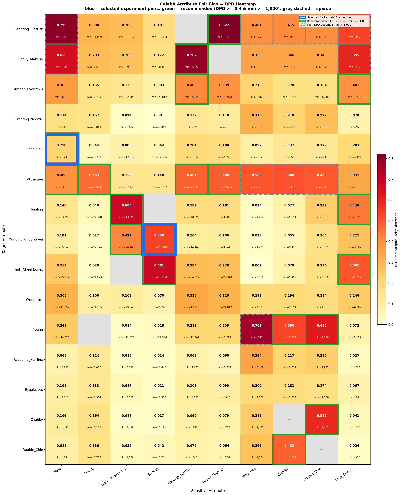
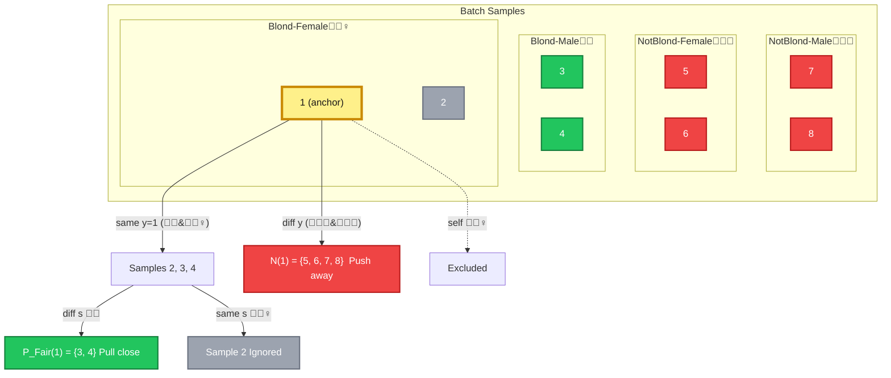
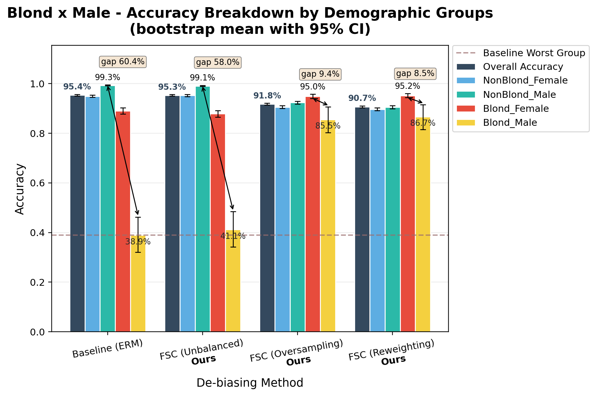
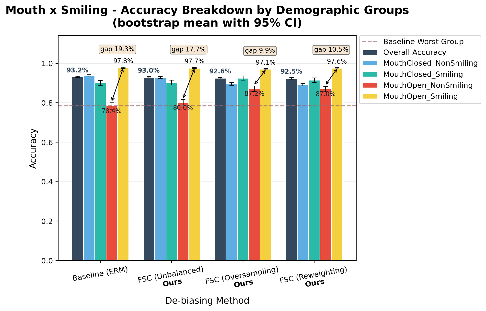
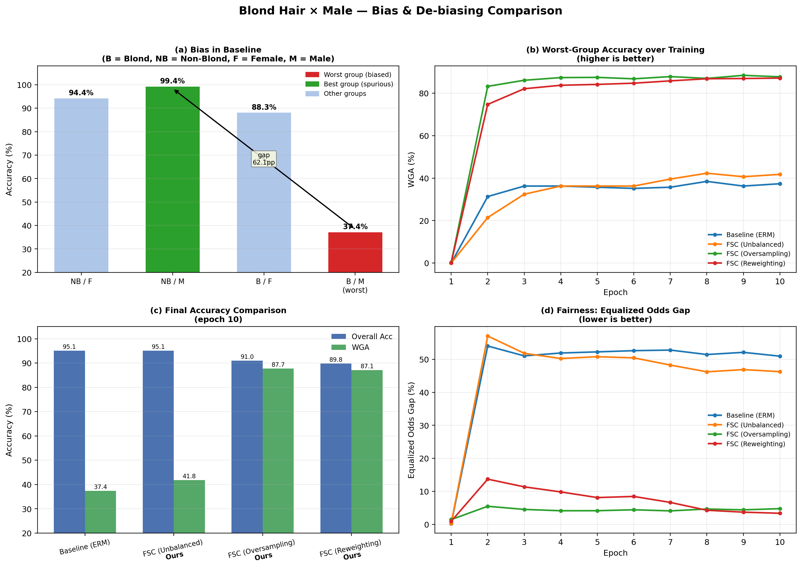
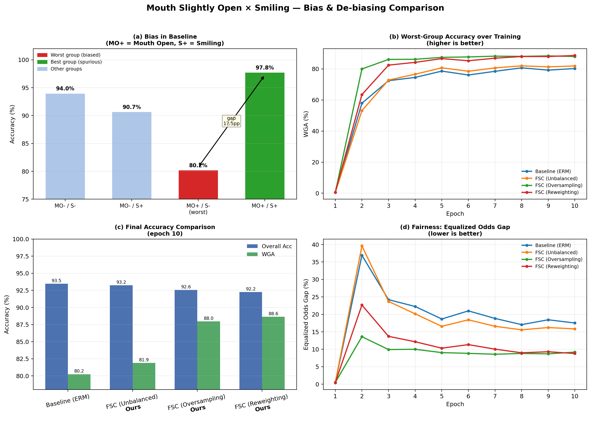

# FairSupCon: De-Biasing CelebA with Fair Supervised Contrastive Learning

EECS 6320 Final Project


## 1. Problem

CelebA has strong spurious correlations between target and sensitive attributes. 85% of blond individuals in the training set are female, so ERM learns gender as a proxy for hair color, yielding only 38.89% accuracy on blond males. Mouth_Slightly_Open and Smiling co-occur with DPD = 0.537, causing a similar shortcut.

Pairwise bias scan across all 40 attributes — three worst pairs:

| Target              | Sensitive | DPD   | WMR   |
| ------------------- | --------- | ----- | ----- |
| Wearing_Lipstick    | Male      | 0.799 | 0.006 |
| Blond_Hair          | Male      | 0.218 | 0.009 |
| Mouth_Slightly_Open | Smiling   | 0.537 | 0.287 |

> DPD = |P(T=1|S=1) - P(T=1|S=0)|, WMR = min group accuracy / max group accuracy.



**Goal:** improve worst-group accuracy without excessive overall accuracy degradation.

---

## 2. Dataset

**CelebA** (Liu et al., 2015): 202,599 aligned face images with 40 binary attributes. Available on [Kaggle](https://www.kaggle.com/datasets/jessicali9530/celeba-dataset).

- Split: 162,770 / 19,867 / 19,962 (train/val/test, official partition)
- Images resized from 178×218 to 224×224

Two target–sensitive pairs studied:

| Task | Target              | Sensitive | Groups                                                                               |
| ---- | ------------------- | --------- | ------------------------------------------------------------------------------------ |
| 1    | Blond_Hair          | Male      | NonBlond_Female, NonBlond_Male, Blond_Female, Blond_Male                             |
| 2    | Mouth_Slightly_Open | Smiling   | MouthClosed_NonSmiling, MouthClosed_Smiling, MouthOpen_NonSmiling, MouthOpen_Smiling |

Group index: `group = target * 2 + sensitive`.

---

## 3. Method

### Baseline (ERM)

ResNet-18 + cross-entropy on the full unbalanced training set.

### Group-Balanced Sampling

Let $\mathcal{G}$ be the four intersectional groups and $N_g$ the count of group $g$.

**Oversampling:** sample each instance with probability $p_i = \frac{1}{4 N_{g_i}}$, yielding a 1:1:1:1 expected ratio per batch.

**Undersampling:** downsample all groups to $N_{min} = \min_{g} N_g$, producing a balanced but smaller dataset.

**Reweighting:** apply per-sample loss weights based on inverse group frequency:

$$w_g = \frac{1/N_g}{\frac{1}{4}\sum_{k \in \mathcal{G}} 1/N_k}, \qquad \mathcal{L}_{\text{rw}} = \frac{1}{N}\sum_{i} w_{g_i} \cdot \mathcal{L}_{\text{CE}}(f(x_i), y_i)$$

### FairSupCon

Standard SupCon pulls all same-label samples together, reinforcing spurious correlations at the representation level. We redefine positives as samples sharing the same label but differing in sensitive attribute:

$$\mathcal{P}_{\text{Fair}}(i) = \lbrace j : j \neq i,\ y_j = y_i,\ s_j \neq s_i \rbrace$$

$$\mathcal{D}(i) = \mathcal{P}_{\text{Fair}}(i) \cup \mathcal{N}(i), \quad \mathcal{N}(i) = \lbrace k : y_k \neq y_i \rbrace$$

Same-label, same-sensitive samples are excluded from both numerator and denominator.

$$\mathcal{L}_{\text{FSC}} = -\frac{1}{|\mathcal{B}|} \sum_{i \in \mathcal{B}} \frac{1}{|\mathcal{P}_{\text{Fair}}(i)|} \sum_{j \in \mathcal{P}_{\text{Fair}}(i)} \log \frac{\exp(\mathbf{z}_i \cdot \mathbf{z}_j / \tau)}{\sum_{k \in \mathcal{D}(i)} \exp(\mathbf{z}_i \cdot \mathbf{z}_k / \tau)}$$

$$\mathcal{L}_{\text{total}} = \mathcal{L}_{\text{CE}} + \lambda \cdot \mathcal{L}_{\text{FSC}}$$


|                | SupCon          | FairSupCon (Ours)                |
| -------------- | --------------- | -------------------------------- |
| Positive pairs | Same label      | Same label + different sensitive |
| Denominator    | All except self | All except self and same-group   |

### Example: 8-Sample Batch

| Sample        | 1      | 2      | 3     | 4     | 5         | 6         | 7         | 8         |
| ------------- | ------ | ------ | ----- | ----- | --------- | --------- | --------- | --------- |
| Label $y$     | Blond  | Blond  | Blond | Blond | Not-Blond | Not-Blond | Not-Blond | Not-Blond |
| Sensitive $s$ | Female | Female | Male  | Male  | Female    | Female    | Male      | Male      |

For anchor i=1 (Blond-Female):



$$\text{term}_1 = -\frac{1}{2}\sum_{j \in \lbrace 3,4 \rbrace} \log \frac{\exp(\mathbf{z}_1 \cdot \mathbf{z}_j / \tau)}{\sum_{k \in \lbrace 3,4,5,6,7,8 \rbrace} \exp(\mathbf{z}_1 \cdot \mathbf{z}_k / \tau)}$$

### Architecture

ResNet-18 (ImageNet pretrained), shared backbone with two heads: projection head (512→128, for contrastive loss) and classification head (512→2, for CE loss).

### Experiment Design

2×2 factorial ablation:

|                   | Unbalanced          | Group-balanced     |
| ----------------- | ------------------- | ------------------ |
| **No FairSupCon** | ① ERM               | ② Balanced only    |
| **FairSupCon**    | ③ FSC only          | ④ Full method      |

Expected: ① < ② ≈ ③ < ④

### Hyperparameters

λ=1.5, τ=0.07, embed_dim=128, batch_size=128, lr=1e-5 (head)/1e-6 (backbone), weight_decay=1e-4, 10 epochs, cosine annealing + 1-epoch warmup.

---

## 4. Results

**Metrics:** Overall Acc, WGA (worst-group accuracy), EqOdd = max(|ΔTPR|, |ΔFPR|). Bootstrap 95% CI, 1000 resamples × 5 seeds.

### Summary

| Task            | WGA               | EqOdd         | Overall Acc Cost |
| --------------- | ----------------- | ------------- | ---------------- |
| Blond × Male    | 38.89% → 86.67%   | 0.50 → 0.09   | ~5%              |
| Mouth × Smiling | 78.45% → 87.22%   | 0.19 → 0.10   | <1%              |

### Per-Group Breakdown

#### Blond_Hair × Male

| Method             | NonBlond_F | NonBlond_M | Blond_F | Blond_M   |
| ------------------ | ---------- | ---------- | ------- | --------- |
| Baseline (ERM)     | 94.98      | 99.34      | 89.07   | **38.89** |
| FSC (Unbalanced)   | 95.28      | 99.11      | 87.90   | **41.11** |
| FSC (Oversampling) | 90.58      | 92.38      | 94.96   | **85.56** |
| FSC (Reweighting)  | 89.72      | 90.56      | 95.20   | **86.67** |

#### Mouth_Slightly_Open × Smiling

| Method             | Closed_NonSmile | Closed_Smile | Open_NonSmile | Open_Smile |
| ------------------ | --------------- | ------------ | ------------- | ---------- |
| Baseline (ERM)     | 93.75           | 90.17        | **78.45**     | 97.79      |
| FSC (Unbalanced)   | 92.88           | 90.34        | **80.01**     | 97.66      |
| FSC (Oversampling) | 89.61           | 92.55        | **87.22**     | 97.09      |
| FSC (Reweighting)  | 89.27           | 91.53        | **87.04**     | 97.55      |

### Why FairSupCon Alone Is Insufficient

| Task            | ERM WGA | FSC (Unbalanced) | Gain  |
| --------------- | ------- | ---------------- | ----- |
| Blond × Male    | 38.89   | 41.11            | +2.22 |
| Mouth × Smiling | 78.45   | 80.01            | +1.56 |

Blond_Male accounts for ~1% of training data; a random batch of 128 typically contains 0–1 such samples, leaving too few cross-group pairs for meaningful gradient signal. Group-balanced sampling ensures minority groups appear consistently in each batch, making the two components complementary rather than redundant.

### Negative Result: Young × Gray_Hair

The Young–Gray_Hair correlation is causal (aging causes gray hair), not spurious.

| Method             | Overall | Young_NonGray | Young_Gray | NonYoung_NonGray | NonYoung_Gray |
| ------------------ | ------- | ------------- | ---------- | ---------------- | ------------- |
| Baseline (ERM)     | ~87%    | ~55%          | ~97%       | ~95%             | ~63%          |
| FSC (Unbalanced)   | ~86%    | ~48%          | ~98%       | ~95%             | ~55%          |
| FSC (Oversampling) | ~83%    | ~65%          | ~90%       | ~88%             | ~71%          |
| FSC (Reweighting)  | ~63%    | ~62%          | ~86%       | ~63%             | ~29%          |

FairSupCon degrades performance across all configurations. Forcing disentanglement of a causal feature removes genuinely predictive information. The method is only appropriate when the target–sensitive correlation is spurious.

### Visualizations










---

## 5. Strengths and Weaknesses

**Strengths:**
- Minimal modification to SupCon: only the positive set definition changes, no extra modules or annotations needed.
- FairSupCon and group-balanced sampling are complementary and together yield consistent gains.
- Bootstrap CI across 5 seeds validates statistical reliability.

**Limitations:**
- Only evaluated on CelebA; generalization to Waterbirds or MultiNLI is untested.
- Binary sensitive attributes only; extension to multi-valued sensitives is non-trivial.
- Fails on causal correlations (Young × Gray_Hair); spuriousness must be assumed and verified externally.
<!-- - Group DRO not included as a final baseline, limiting direct comparison with prior work. -->
<!-- - Unclear which bias statistic (DPD vs. WMR) better predicts benefit from FairSupCon. -->

---

## 6. Reproducibility

Code: [github.com/chuaii/CelebA-Debias](https://github.com/chuaii/CelebA-Debias)  
Dataset: [kaggle.com/datasets/jessicali9530/celeba-dataset](https://www.kaggle.com/datasets/jessicali9530/celeba-dataset)

`datasets/` and `checkpoints/` are not tracked; create `datasets/` locally after cloning.

```
CelebA/                              # repo root
├── datasets/                        # CelebA files (not tracked)
│   ├── list_attr_celeba.csv         # 40 attrs
│   ├── list_eval_partition.csv      # train/val/test split
│   └── img_align_celeba/            # aligned face images
│       └── *.jpg
├── checkpoints/                     # output from training (not tracked)
│   ├── wga/                         # best ckpt by WGA
│   │   └── best_<tag>.pt
│   └── eqodd/                       # best ckpt by EqOdd gap
│       └── best_<tag>.pt
├── fair_supcon/
│   ├── config.py          # paths and task attrs
│   ├── dataset.py         # dataloader + group-balanced sampling
│   ├── model.py           # ResNet-18 + projection/cls heads
│   ├── loss.py            # FairSupConLoss, GroupWeightedCE, TotalLoss
│   ├── train.py           # training loop
│   ├── eval.py            # accuracy / WGA / EqOdd
│   ├── bootstrap_eval.py  # bootstrap CI over checkpoints/wga/
│   └── utils.py           # BestTracker for wga/ and eqodd/
├── outputs/               # CSV logs, bootstrap tables
├── figures/               # plots for the paper
├── plots/                 # plotting scripts
├── group_balance/         # standalone group-balance experiments
└── requirements.txt
```

```bash
pip install -r requirements.txt

cd fair_supcon
python train.py --lambda-con 0.0                                    # ERM (baseline)
python train.py --lambda-con 1.5                                    # FairSupCon
python train.py --lambda-con 1.5 --group-balance oversampling       # + oversampling
python train.py --lambda-con 1.5 --group-balance reweighting        # + reweighting

python eval.py --checkpoint ../checkpoints/wga/best_<tag>.pt --report   # use actual filename
python bootstrap_eval.py --checkpoint-dir ../checkpoints/wga            # bootstrap CI
```

Results in `outputs/`, figures in `figures/`.

---

## References

- Liu et al. (2015). Deep Learning Face Attributes in the Wild. *ICCV*.
- Khosla et al. (2020). Supervised Contrastive Learning. *NeurIPS*.
- Sagawa et al. (2020). Distributionally Robust Neural Networks for Group Shifts. *ICLR*.
