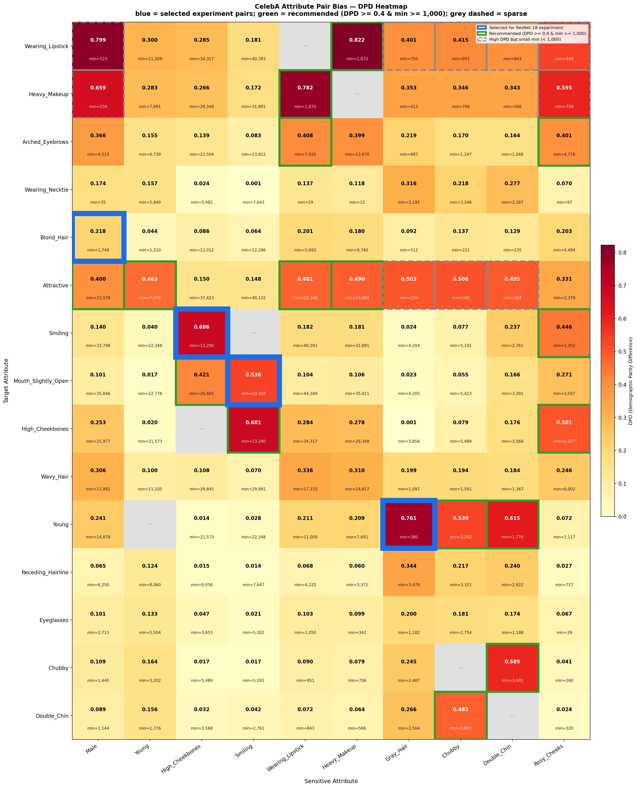

# Fair Classification on CelebA

## 1. De-biasing Method

**Task:** Study bias between attribute pairs in CelebA. ERM learns shortcuts when a target attribute co-occurs strongly with a sensitive attribute (e.g. most *Blond* samples are female, so the model learns *"blond ≈ female"* instead of hair color).

We select high-bias pairs from a full pairwise bias analysis of all 40 CelebA attributes:

| Target               | Sensitive        |  DPD  |  WMR  |
| -------------------- | ---------------- | :---: | :---: |
| Wearing_Lipstick     | Male             | 0.799 | 0.006 |
| Blond_Hair           | Male             | —     | 0.009 |
| Mouth_Slightly_Open  | Smiling          | 0.537 | 0.287 |

> DPD = \|P(T=1\|S=1) − P(T=1\|S=0)\|, WMR = min(group) / max(group).

**Experiment Design:** FairSupCon + group-balanced sampling, with ablation to see what each part does. Group DRO (Sagawa et al., ICLR 2020) as other SOTA.

| Stage | **Method**                                                                           | **Sampling**   | **Loss**       | **What it fixes?**                 |
| ----- | ------------------------------------------------------------------------------------ | -------------- | -------------- | ---------------------------------- |
| ①     | ERM                                                                                  | Unbalanced     | CE             | Baseline, expose shortcut          |
| ②     | + 3 group-balanced only: ( Oversampling / Undersampling / Reweighting ) | Group-balanced | CE             | Data-level de-bias                 |
| ③     | + FairSupCon only                                                                    | Unbalanced     | CE + λ·FSC     | Representation-level de-bias       |
| ④     | Balanced (Oversampling / Reweighting) + FairSupCon                                   | Group-balanced | CE + λ·FSC     | Combine both levels                |
| ⑤     | vs Group DRO                                                                         | Unbalanced     | DRO            | Compared to other SOTA             |

This is a **2×2 ablation matrix**：

|                   | Unbalanced (Random) | Group-balanced           |
| ----------------- | ------------------- | ------------------------ |
| **No FairSupCon** | ① ERM               | ② ERM + Balanced Methods |
| **FairSupCon**    | ③ ERM + FairSupCon  | ④ **Final Method**       |

This design is called **factorial ablation**.

**Expected**:

*① ERM < ② Balanced only ≈ ③ FairSupCon only < ④ Combined ≈ ⑤ Group DRO*

> ② and ③ are roughly comparable; which is better depends on the bias type. Strong group imbalance (low WMR) favors ②; representation-level shortcut learning favors ③. ④ combining both is expected to be best among our methods.

## 2. Formulation

### 2.1 Background — SupCon

SupCon (Khosla et al., NeurIPS 2020) uses labels to pick positive pairs. For anchor $i$, any sample with the same label is a positive:

$$\mathcal{P}_{\text{SupCon}}(i) = \left\lbrace i \neq j \mid y_i = y_j \right\rbrace$$

$$\mathcal{L}_{\text{SupCon}} = -\frac{1}{|\mathcal{B}|}\sum_{i \in \mathcal{B}} \frac{1}{|\mathcal{P}_{\text{SupCon}}(i)|} \sum_{j \in \mathcal{P}_{\text{SupCon}}(i)} \log \frac{\exp(\text{sim}(i,j) / \tau)}{\sum_{k \neq i} \exp(\text{sim}(i,k) / \tau)}$$

where $\text{sim}(i,j) = \mathbf{z}_i \cdot \mathbf{z}_j$ (cosine similarity, L2-normalized). Same-class pulled closer, different-class pushed apart.

**Problem:** SupCon treats all same-label pairs equally. If most *Mouth\_Slightly\_Open* samples are also *Smiling*, it clusters by smiling expression, not mouth position.

### 2.2 FairSupCon Loss

We only pair samples with **same label but different sensitive attribute**:

$$\mathcal{P}_{\text{Fair}}(i) = \left\lbrace i \neq j \mid y_i = y_j \wedge s_i \neq s_j \right\rbrace$$

e.g. MouthOpen\_NonSmiling ( $y=1, s=0$ ) only pairs with MouthOpen\_Smiling ( $y=1, s=1$ ), never another MouthOpen\_NonSmiling. This forces the encoder to learn mouth-position features instead of smiling expression.

But if we keep the standard denominator, same-class same-attribute samples get pushed apart, which breaks clustering. So we fix the denominator too.

Negative set — everything with a different label:

$$\mathcal{N}(i) = \left\lbrace k \mid y_k \neq y_i \right\rbrace$$

Denominator set — union of cross-attribute positives and negatives:

$$\mathcal{D}(i) = \mathcal{P}_{\text{Fair}}(i) \cup \mathcal{N}(i)$$

Same-label same-attribute samples ( $y_k = y_i \wedge s_k = s_i$ ) are left out of $\mathcal{D}(i)$ — not pulled, not pushed, they just cluster on their own.

$$\mathcal{L}_{\text{FSC}} = - \frac{1}{|\mathcal{B}|} \sum_{i \in \mathcal{B}} \frac{1}{|\mathcal{P}_{\text{Fair}}(i)|} \sum_{j \in \mathcal{P}_{\text{Fair}}(i)} \log \frac{\exp(\mathbf{z}_i \cdot \mathbf{z}_j / \tau)}{\sum_{k \in \mathcal{D}(i)} \exp(\mathbf{z}_i \cdot \mathbf{z}_k / \tau)}$$

### 2.3 Total Loss & Hyperparameters

$$\mathcal{L}_{\text{total}} = \mathcal{L}_{\text{CE}} + \lambda \cdot \mathcal{L}_{\text{FSC}}$$

| Symbol    | What it is                 | Value                |
| --------- | -------------------------- | -------------------- |
| $\lambda$ | FairSupCon weight          | 1.5 (0 for baseline) |
| $\tau$    | Temperature                | 0.07                 |
| $d$       | Projection head output dim | 128                  |
| $B$       | Batch size                 | 128                  |

## 3. Responsibilities

| Member      | What they're doing                                 |
| ----------- | -------------------------------------------------- |
| **Vaibhav** | Baseline ERM; Group DRO baseline                   |
| **Huayi**   | FairSupCon loss design & implementation            |
| **Matthew** | Group-balanced methods                             |
| **??**      | Fairness evaluation (Visualize results and report) |

## 4. Timeline & Milestones

| Date            | Milestone                                               |
| --------------- | ------------------------------------------------------- |
| **Mar 6 (Q1)**  | Problem defined; action plan finalized                  |
| **Mar 13 (Q2)** | Pipeline working; baseline + FairSupCon initial results |
| **Mar 20**      | Hyperparameter sweep; ablation analysis                 |
| **Mar 27 (Q3)** | Full comparison; fairness evaluation; final report      |

## 5. Experiment Results

### Evaluation Summary

| Task | Method | Overall Acc | WGA | EqOdd | Worst Group |
| ---- | ------ | :---------: | :-: | :---: | ----------- |
| Blond × Male | Baseline (ERM) | 0.9539 [0.9510, 0.9568] | 0.3889 [0.3200, 0.4624] | 0.5018 [0.4283, 0.5723] | Blond_Male |
| Blond × Male | FSC (Unbalanced) | 0.9532 [0.9504, 0.9562] | 0.4111 [0.3416, 0.4842] | 0.4679 [0.3930, 0.5400] | Blond_Male |
| Blond × Male | FSC (Oversampling) | 0.9176 [0.9136, 0.9214] | 0.8556 [0.8022, 0.9034] | 0.0940 [0.0433, 0.1480] | Blond_Male |
| Blond × Male | FSC (Reweighting) | 0.9069 [0.9029, 0.9109] | **0.8667** [0.8154, 0.8994] | **0.0853** [0.0358, 0.1382] | Blond_Male |
| Mouth × Smiling | Baseline (ERM) | 0.9315 [0.9280, 0.9350] | 0.7845 [0.7676, 0.8008] | 0.1934 [0.1768, 0.2105] | MouthOpen_NonSmiling |
| Mouth × Smiling | FSC (Unbalanced) | 0.9296 [0.9261, 0.9332] | 0.8001 [0.7839, 0.8161] | 0.1765 [0.1599, 0.1931] | MouthOpen_NonSmiling |
| Mouth × Smiling | FSC (Oversampling) | 0.9255 [0.9220, 0.9291] | **0.8722** [0.8584, 0.8853] | **0.0987** [0.0850, 0.1132] | MouthOpen_NonSmiling |
| Mouth × Smiling | FSC (Reweighting) | 0.9246 [0.9209, 0.9282] | 0.8704 [0.8565, 0.8835] | 0.1051 [0.0915, 0.1191] | MouthOpen_NonSmiling |

> Test-set point estimate; brackets = bootstrap 95% CI (5000 resamples; see `outputs/bootstrap_ci_summary.csv`). WGA = Worst Group Accuracy (higher is better), EqOdd = Equalized Odds gap (lower is better). Bold = best point estimate within each task on WGA / EqOdd.

### Group Accuracy Breakdown (bootstrap 95% CI)

#### BlondHair × Male

#### Mouth_Slightly_Open × Smiling

### Bootstrap CI gap (Task 0 & Task 3)

#### Task 0 — Blond Hair × Male

#### Task 3 — Mouth_Slightly_Open × Smiling

### Training Curves

#### BlondHair × Male

- Training log: `outputs/training_blond_male.csv`

#### Mouth_Slightly_Open × Smiling

- Training log: `outputs/training_mouth_smiling.csv`

