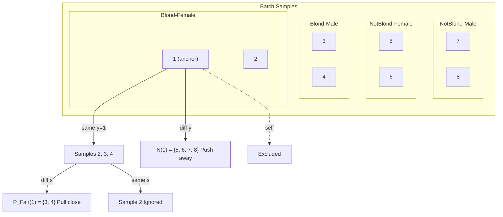

# FairSupCon: Fair Supervised Contrastive Learning

## File Structure

```
fair_supcon/
├── config.py           # hyperparameters and dataset paths
├── dataset.py          # CelebA dataset loader with group-balanced sampling
├── model.py            # ResNet-18 with projection + classification heads
├── loss.py             # FairSupConLoss, GroupWeightedCE, TotalLoss
├── train.py            # training loop (ERM baseline or FairSupCon)
├── eval.py             # evaluation: accuracy, WGA, EqOdd
├── bootstrap_eval.py   # bootstrap confidence intervals for checkpoints
└── utils.py            # seed, device, logging, checkpoint tracker
```

## Problem

Standard models learn shortcuts from biased data.

Example: CelebA "Blond Hair" prediction -- most blond samples are female, so the model learns **blond = female** instead of actual hair color.

SupCon makes it worse: it pulls all same-label samples together. When blond samples are mostly female, the encoder clusters by **gender** instead of **hair color**.

## Core Idea

**Only pull together samples with the same label but different sensitive attributes.**

- Blond-Female pairs with Blond-Male (not another Blond-Female)
- Forces the encoder to learn **task-relevant features** (hair color), not shortcuts (gender)

## Key Formulas

### 1. Fair Positive Set

$$\mathcal{P}_{\text{Fair}}(i) = \lbrace j : j \neq i,\ y_j = y_i,\ s_j \neq s_i \rbrace$$

Not self, same label, different sensitive attribute.

### 2. Denominator Set

$$\mathcal{D}(i) = \mathcal{P}_{\text{Fair}}(i) \cup \mathcal{N}(i),\ \text{where} \ \ \mathcal{N}(i) = \lbrace k : y_k \neq y_i \rbrace$$

Only fair positives + negatives enter the denominator. Same-label-same-attribute samples are **ignored** (not pulled, not pushed).

### 3. FairSupCon Loss

$$\mathcal{L}_{\text{FSC}} = -\frac{1}{|\mathcal{B}|} \sum_{i \in \mathcal{B}} \left[ \frac{1}{|\mathcal{P}_{\text{Fair}}(i)|} \sum_{j \in \mathcal{P}_{\text{Fair}}(i)} \left( \log \frac{\exp(\mathbf{z}_i \cdot \mathbf{z}_j / \tau)}{\sum_{k \in \mathcal{D}(i)} \exp(\mathbf{z}_i \cdot \mathbf{z}_k / \tau)} \right) \right]$$


### 4. Total Loss

$$\mathcal{L}_{\text{total}} = \mathcal{L}_{\text{CE}} + \lambda \cdot \mathcal{L}_{\text{FSC}}$$

## Example: 8-sample Batch


| Sample        | 1      | 2      | 3     | 4     | 5         | 6         | 7        | 8        |
| ------------- | ------ | ------ | ----- | ----- | --------- | --------- | -------- | -------- |
| Label $y$     | Blond  | Blond  | Blond | Blond | Not-Blond | Not-Blond | Not-Blond | Not-Blond |
| Sensitive $s$ | Female | Female | Male  | Male  | Female    | Female    | Male     | Male     |


**For anchor i=1 (Blond-Female):**




|                             | Action     | Samples              | Why                     |
| --------------------------- | ---------- | -------------------- | ----------------------- |
| $\mathcal{P}_{\text{Fair}}$ | Pull close | {3, 4} Blond-Male   | Same label, diff gender |
| $\mathcal{N}$               | Push away  | {5, 6, 7, 8}        | Different label         |
| Ignored                     | Neither    | {2} Blond-Female     | Same label, same gender |


**Loss for i=1:**

$$
\text{term}_1 = -\frac{1}{2}\sum_{j \in \lbrace 3,4 \rbrace} \log \frac{\exp(\mathbf{z}_1 \cdot \mathbf{z}_j / \tau)}{\sum_{k \in \lbrace 3,4,5,6,7,8 \rbrace} \exp(\mathbf{z}_1 \cdot \mathbf{z}_k / \tau)}
$$

Numerator: similarity with cross-group positives (Blond-Male). Denominator: all of $\mathcal{D}(1)=\lbrace 3,4,5,6,7,8 \rbrace$. Minimizing this loss maximizes the relative similarity with fair positives.

## SupCon vs FairSupCon (Ours)


|                | SupCon               | FairSupCon (Ours)                          |
| -------------- | -------------------- | ------------------------------------ |
| Positive pairs | Same label           | Same label **+ different sensitive** |
| Denominator    | All except self      | All except self **and same-group**   |
| Risk           | Clusters by shortcut | Clusters by task-relevant features   |

## Usage

All commands run from `fair_supcon/`:

```bash
cd fair_supcon
```

### Train

```bash
# ERM baseline
python train.py --lambda-con 0.0

# FairSupCon (unbalanced)
python train.py --lambda-con 1.5

# FairSupCon + oversampling
python train.py --lambda-con 1.5 --group-balance oversampling

# FairSupCon + reweighting
python train.py --lambda-con 1.5 --group-balance reweighting
```

Optional flags: `--epochs 10`, `--lr 1e-5`, `--bs 128`, `--temperature 0.07`, `--csv path/to/log.csv`

### Evaluate

```bash
python eval.py --checkpoint ../checkpoints/best_model.pt

# with detailed fairness report
python eval.py --checkpoint ../checkpoints/best_model.pt --report
```

Optional flags: `--split val|test`, `--bs 128`

### Bootstrap CI

```bash
python bootstrap_eval.py
```

Task and checkpoint configs are defined inside the script. Results are saved to `outputs/bootstrap_ci_summary.csv`.
